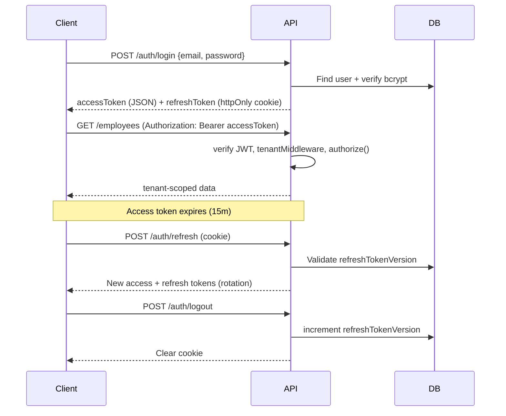

# Authentication Flow

## RBAC Enforcement Layers

1. **JWT** — role, companyId, employeeId in claims
2. **tenantMiddleware** — binds company, checks suspended status
3. **requireFeature** — subscription feature flags
4. **authorize(permission)** — role → permission map
