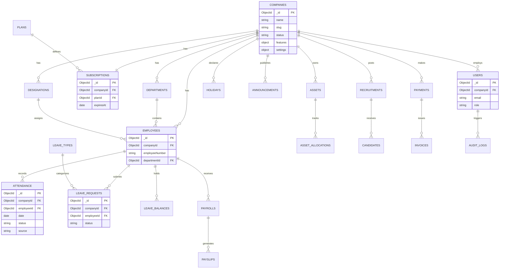

# HRFlow AI — Entity Relationship Diagram

## Multi-Tenant Isolation

Every query from tenant context MUST include `companyId` filter injected by `tenantMiddleware` from JWT claims — never from client body alone.
